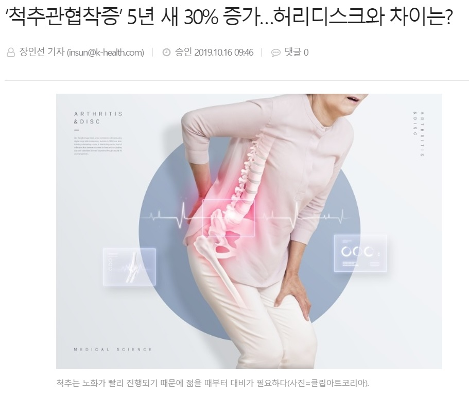
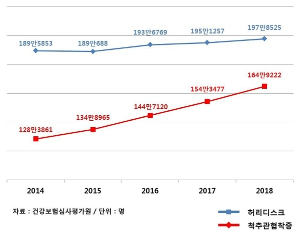
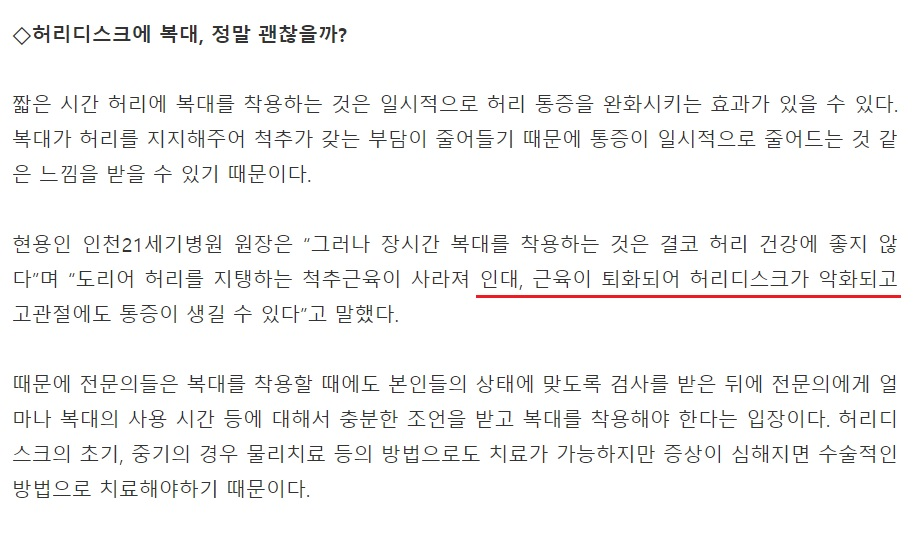
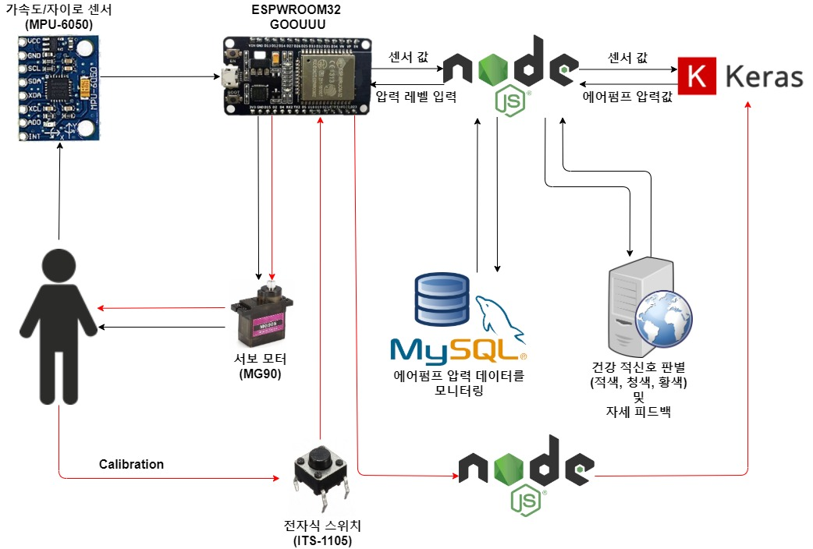

역학센서를 이용한 허리 밸런스 유지 장치
========================================

팀명 : 두통치통보다 요통
------------------------

항상 허리가 아픈 현대인을 위해서..
 
### 우리 몸의 대들보인 허리!  현대인들의 허리 건강에 적신호가 켜졌다!
   * 인구 고령화로 인해서 요통 환자들이 늘고 있다.
    

</img>
    

</img>
    
### 어떻게 해결하고 있을까?
   * 다음은 허리의 부담을 완화해주는 허리 보호대를 착용하여 해결하고 있는 모습이다.
    

</img>
    
#### 복대의 단점
   

</img>
   

</img>
   * 일시적인 착용은 허리의 부담을 덜어줄 수 있지만, 장시간 의존하게 되면 복근과 기립근이 약해져 또 다른 통증을 유발한다!
   
#### 뒤틀어진 자세 
   * 척추 측만증과 허리디스크를 초래할 수 있다.
   * 하지만, 자신의 자세가 올바른지 확인할 방법이 없다!
   
### 해결 방안
  * 복대의 압력을 상황에 맞게 조절한다면?  
    복대 의존도를 낮춤으로써, 근육 약화를 방지할 수 있다!
  * 자신의 자세를 모니터링할 수 있다면?  
    자신의 문제점을 파악함으로써 올바른 자세로 교정할 수 있다!
  
### 프로젝트 설명
  

</img>
  
  * 자동 조절 시스템
  1. 복대에 부착된 센서로부터 사용자의 자세를 추정한다.
  2. LSTM 모델을 이용하여 사용자의 자세에 맞는 복대의 압력을 계산한다.
  3. 해당 압력에 부합하게 에어 펌프(DAP-370P)를 이용하여 복대를 조절한다.  
  
  * 커스터마이징
  1. LSTM 모델이 계산한 복대의 압력이 사용자와 맞지 않을 경우, 사용자가 임의로 압력을 조절할 수 있게 한다.
  2. 사용자가 설정한 압력을 토대로 LSTM 모델을 업데이트한다.  
  
  * 자세 모니터링 시스템
  1. 1분 간격으로 센서 데이터를 Database에 누적시킨다.
  2. Web Server에서 Database 값을 이용하여 추정한 사용자의 자세를 볼 수 있게 한다.
  3. 지난 24시간 동안의 사용자의 자세를 평가한다.
  
### 성과
  * 복대의 압력을 상황에 맞게 조절해줌으로써, 직관적인 보조작동을 가능하게 한다.
  * 사용자가 본인의 자세를 파악함으로써, 원활한 자세 교정이 이루어질 수 있다.
  
### Team

  * 김주현 (팀장)  
</img>  
    Deep Learning 모델 구축  
  * 박영재 (Committer)  
</img>  
    Sensor - DB 네트워킹  
  * 전범준  
</img>  
    Web Server 관리 및 User Experience  
  
## 개발환경
  * Arduino (Gyro, Acceleration sensor)
  * MySQL
  * Node.js / Express-Framework
  * Python3.8 (Keras)
  * HTTP / PHP
  * Github (pull request)  
  
  |Date|Event|
  |:------------:|:-------------------:|
  |2020.04.09.|프로젝트 컨셉 회의|
  |2020.04.11.|MD 파일 작성|
